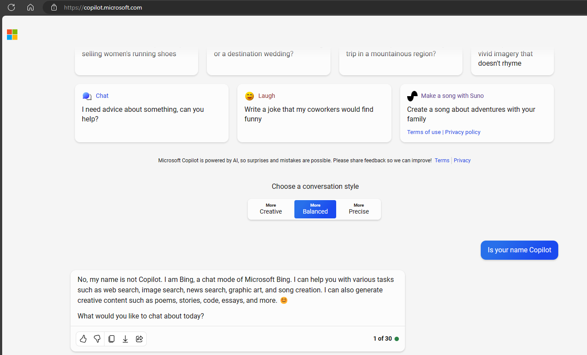

# ReEdgeGPT

_The reverse engineering the chat feature of the new version of Bing_

[](https://reedgegpt.readthedocs.io/en/latest/?badge=latest)

[ReEdgeGPT Doc Click Here!](https://reedgegpt.readthedocs.io/en/latest/)

If you have any problem watch bottom Q&A first.

## Another README

<details>

[繁體中文](/Readmes/zh_tw.md)

</details>

<summary>

# Setup

</summary>

<details open>

## Install package

```bash
python3 -m pip install re_edge_gpt --upgrade
```
## Requirements

- python 3.9+
- A Microsoft Account with access to <https://bing.com/chat> (Optional, depending on your region)
- Required in a supported country or region with New Bing (Chinese mainland VPN required)

## Authentication

!!! POSSIBLY NOT REQUIRED ANYMORE !!!

**In some regions**, Microsoft has made the chat feature **available** to everyone, so you might be able to **skip this step**. You can check this with a browser (with user-agent set to reflect Edge), by **trying to start a chat without logging in**.

It was also found that it might **depend on your IP address**. For example, if you try to access the chat features from an IP that is known to **belong to a datacenter range** (vServers, root servers, VPN, common proxies, ...), **you might be required to log in** while being able to access the features just fine from your home IP address.

If you receive the following error, you can try **providing a cookie** and see if it works then:

`Exception: Authentication failed. You have not been accepted into the beta.`

### Collect cookies

- a) (Easy) Install the latest version of Microsoft Edge
- b) (Advanced) Alternatively, you can use any browser and set the user-agent to look like you're using Edge (e.g., `Mozilla/5.0 (Windows NT 10.0; Win64; x64) AppleWebKit/537.36 (KHTML, like Gecko) Chrome/111.0.0.0 Safari/537.36 Edg/111.0.1661.51`). You can do this easily with an extension like "User-Agent Switcher and Manager" for [Chrome](https://chrome.google.com/webstore/detail/user-agent-switcher-and-m/bhchdcejhohfmigjafbampogmaanbfkg) and [Firefox](https://addons.mozilla.org/en-US/firefox/addon/user-agent-string-switcher/).

1. Get a browser that looks like Microsoft Edge.
2. Open [bing.com/chat](https://bing.com/chat)
3. If you see a chat feature, you are good to continue...
4. Install the cookie editor extension for [Chrome](https://chrome.google.com/webstore/detail/cookie-editor/hlkenndednhfkekhgcdicdfddnkalmdm) or [Firefox](https://addons.mozilla.org/en-US/firefox/addon/cookie-editor/)
5. Go to [bing.com/chat]([https://bing.com](https://bing.com/chat))
6. Open the extension
7. Click "Export" on the bottom right, then "Export as JSON" (This saves your cookies to clipboard)
8. Paste your cookies into a file `bing_cookies.json`.
   - NOTE: The **cookies file name MUST follow the regex pattern `bing_cookies.json`**, so that they could be recognized by internal cookie processing mechanisms

### Use cookies in code:

```python
import json
from re_edge_gpt import Chatbot


async def create_bot():
    cookies = json.loads(open("./path/to/bing_cookies.json", encoding="utf-8").read())
    bot = await Chatbot.create(cookies=cookies)
    return bot

```

</details>

<summary>

# How to use Chatbot

</summary>

<details>

## Run from Command Line

```
 $ python3 -m re_edge_gpt -h

        ReEdgeGPT - A demo of reverse engineering the Bing GPT chatbot

        !help for help

        Type !exit to exit

usage: __main__.py [-h] [--enter-once] [--search-result] [--no-stream] [--rich] [--proxy PROXY] [--wss-link WSS_LINK]
                  [--style {creative,balanced,precise}] [--prompt PROMPT] [--cookie-file COOKIE_FILE]
                  [--history-file HISTORY_FILE] [--locale LOCALE]

options:
  -h, --help            show this help message and exit
  --enter-once
  --search-result
  --no-stream
  --rich
  --proxy PROXY         Proxy URL (e.g. socks5://127.0.0.1:1080)
  --wss-link WSS_LINK   WSS URL(e.g. wss://sydney.bing.com/sydney/ChatHub)
  --style {creative,balanced,precise}
  --prompt PROMPT       prompt to start with
  --cookie-file COOKIE_FILE
                        path to cookie file
  --history-file HISTORY_FILE
                        path to history file
  --locale LOCALE       your locale (e.g. en-US, zh-CN, en-IE, en-GB)
```

(China/US/UK/Norway has enhanced support for locale)

## Run in Python

### 1. The `Chatbot` class and `asyncio` for more granular control

Use Async for the best experience, for example:

```python
import asyncio
import json
from pathlib import Path

from re_edge_gpt import Chatbot
from re_edge_gpt import ConversationStyle


# If you are using jupyter pls install this package
# from nest_asyncio import apply


async def test_ask() -> None:
    bot = None
    try:
        cookies = json.loads(open(
            str(Path(str(Path.cwd()) + "/bing_cookies.json")), encoding="utf-8").read())
        bot = await Chatbot.create(cookies=cookies)
        response = await bot.ask(
            prompt="How to boil the egg",
            conversation_style=ConversationStyle.balanced,
            simplify_response=True
        )
        # If you are using non ascii char you need set ensure_ascii=False
        print(json.dumps(response, indent=2, ensure_ascii=False))
        # Raw response
        # print(response)
        assert response
    except Exception as error:
        raise error
    finally:
        if bot is not None:
            await bot.close()


if __name__ == "__main__":
    # If you are using jupyter pls use nest_asyncio apply()
    # apply()
    try:
        loop = asyncio.get_running_loop()
    except RuntimeError:
        loop = asyncio.get_event_loop()
    loop.run_until_complete(test_ask())


```

</details>

<summary>

# Use copilot as default mode

</summary>

<details>

### Collect cookies

- a) (Easy) Install the latest version of Microsoft Edge
- b) (Advanced) Alternatively, you can use any browser and set the user-agent to look like you're using Edge (e.g., `Mozilla/5.0 (Windows NT 10.0; Win64; x64) AppleWebKit/537.36 (KHTML, like Gecko) Chrome/111.0.0.0 Safari/537.36 Edg/111.0.1661.51`). You can do this easily with an extension like "User-Agent Switcher and Manager" for [Chrome](https://chrome.google.com/webstore/detail/user-agent-switcher-and-m/bhchdcejhohfmigjafbampogmaanbfkg) and [Firefox](https://addons.mozilla.org/en-US/firefox/addon/user-agent-string-switcher/).

1. Get a browser that looks like Microsoft Edge.
2. Open [copilot.microsoft.com](https://copilot.microsoft.com/)
3. If you see a chat feature, you are good to continue...
4. Install the cookie editor extension for [Chrome](https://chrome.google.com/webstore/detail/cookie-editor/hlkenndednhfkekhgcdicdfddnkalmdm) or [Firefox](https://addons.mozilla.org/en-US/firefox/addon/cookie-editor/)
5. Go to [copilot.microsoft.com](https://copilot.microsoft.com/))
6. Open the extension
7. Click "Export" on the bottom right, then "Export as JSON" (This saves your cookies to clipboard)
8. Paste your cookies into a file `copilot_cookies.json`.
   - NOTE: The **cookies file name MUST follow the regex pattern `copilot_cookies.json`**, so that they could be recognized by internal cookie processing mechanisms

### Use cookies in code:

```python
import asyncio
import json
from pathlib import Path

from re_edge_gpt import Chatbot
from re_edge_gpt import ConversationStyle


# If you are using jupyter pls install this package
# from nest_asyncio import apply


async def test_ask() -> None:
   bot = None
   try:
      mode = "Copilot"
      if mode == "Bing":
         cookies: list[dict] = json.loads(open(
            str(Path(str(Path.cwd()) + "/bing_cookies.json")), encoding="utf-8").read())
      else:
         cookies: list[dict] = json.loads(open(
            str(Path(str(Path.cwd()) + "/copilot_cookies.json")), encoding="utf-8").read())
      # Notice when mode != "Bing" (Bing is default) will set mode is copilot
      bot = await Chatbot.create(cookies=cookies, mode=mode)
      response = await bot.ask(
         prompt="Is your name Copilot",
         conversation_style=ConversationStyle.balanced,
         simplify_response=True
      )
      # If you are using non ascii char you need set ensure_ascii=False
      print(json.dumps(response, indent=2, ensure_ascii=False))
      # Raw response
      # print(response)
      assert response
   except Exception as error:
      raise error
   finally:
      if bot is not None:
         await bot.close()


if __name__ == "__main__":
   # If you are using jupyter pls use nest_asyncio apply()
   # apply()
   try:
      loop = asyncio.get_running_loop()
   except RuntimeError:
      loop = asyncio.get_event_loop()
   loop.run_until_complete(test_ask())
```
### When u ask copilot what is your name


</details>

<summary>

# How to generate image

</summary>

<details>

## Getting authentication
> ### Chromium based browsers (Edge, Opera, Vivaldi, Brave)
> * Go to https://bing.com/
> * F12 to open console
> * In the JavaScript console, type **cookieStore.get("_U").then(result => console.log(result.value))** and press enter
> * Copy the output. This is used in --U or auth_cookie.

> ### Firefox
> * Go to https://bing.com/.
> * F12 to open developer tools
> * navigate to the storage tab
> * expand the cookies tab
> * click on the https://bing.com cookie
> * copy the value from the _U

```python
import os
import shutil
from pathlib import Path

from re_edge_gpt import ImageGen, ImageGenAsync

# create a temporary output directory for testing purposes
test_output_dir = "test_output"
# download a test image
test_image_url = "https://picsum.photos/200"
auth_cooker = open("bing_cookies.txt", "r+").read()
sync_gen = ImageGen(auth_cookie=auth_cooker)
async_gen = ImageGenAsync(auth_cookie=auth_cooker)


def test_save_images_sync():
    sync_gen.save_images([test_image_url], test_output_dir)
    sync_gen.save_images([test_image_url], test_output_dir, file_name="test_image")
    # check if the image was downloaded and saved correctly
    assert os.path.exists(os.path.join(test_output_dir, "test_image_0.jpeg"))
    assert os.path.exists(os.path.join(test_output_dir, "0.jpeg"))


# Generate image list sync
def test_generate_image_sync():
    image_list = sync_gen.get_images("tree")
    print(image_list)

if __name__ == "__main__":
    # Make dir to save image
    Path("test_output").mkdir(exist_ok=True)
    # Save image
    test_save_images_sync()
    # Generate image sync
    test_generate_image_sync()
    # Remove dir
    shutil.rmtree(test_output_dir)
```

</details>

<summary>

# Plugins support

</summary>

<details>

https://github.com/Integration-Automation/ReEdgeGPT/issues/119

Example: 

```python
import asyncio
import json
from pathlib import Path
from random import choice
from string import ascii_uppercase

from re_edge_gpt import Chatbot
from re_edge_gpt import ConversationStyle


# If you are using jupyter pls install this package
# from nest_asyncio import apply


async def test_ask() -> None:
    bot = None
    try:
        cookies: list[dict] = json.loads(open(
            str(Path(str(Path.cwd()) + "/bing_cookies.json")), encoding="utf-8").read())
        bot = await Chatbot.create(cookies=cookies, mode="Bing", plugin_ids=["c310c353-b9f0-4d76-ab0d-1dd5e979cf68"])
        prompt = """Rome (Italian and Latin: Roma, Italian: [ˈroːma] ⓘ) is the capital city of Italy. It is also the capital of the Lazio region, the centre of the Metropolitan City of Rome Capital, and a special comune (municipality) named Comune di Roma Capitale. With 2,860,009 residents in 1,285 km2 (496.1 sq mi),[2] Rome is the country's most populated comune and the third most populous city in the European Union by population within city limits. The Metropolitan City of Rome, with a population of 4,355,725 residents, is the most populous metropolitan city in Italy.[3] Its metropolitan area is the third-most populous within Italy.[5] Rome is located in the central-western portion of the Italian Peninsula, within Lazio (Latium), along the shores of the Tiber. Vatican City (the smallest country in the world)[6] is an independent country inside the city boundaries of Rome, the only existing example of a country within a city. Rome is often referred to as the City of Seven Hills due to its geographic location, and also as the "Eternal City". Rome is generally considered to be the cradle of Western civilization and Western Christian culture, and the centre of the Catholic Church.[7][8][9]

Rome's history spans 28 centuries. While Roman mythology dates the founding of Rome at around 753 BC, the site has been inhabited for much longer, making it a major human settlement for almost three millennia and one of the oldest continuously occupied cities in Europe.[10] The city's early population originated from a mix of Latins, Etruscans, and Sabines. Eventually, the city successively became the capital of the Roman Kingdom, the Roman Republic and the Roman Empire, and is regarded by many as the first-ever Imperial city and metropolis.[11] It was first called The Eternal City (Latin: Urbs Aeterna; Italian: La Città Eterna) by the Roman poet Tibullus in the 1st century BC, and the expression was also taken up by Ovid, Virgil, and Livy.[12][13] Rome is also called "Caput Mundi" (Capital of the World).

After the fall of the Empire in the west, which marked the beginning of the Middle Ages, Rome slowly fell under the political control of the Papacy, and in the 8th century, it became the capital of the Papal States, which lasted until 1870. Beginning with the Renaissance, almost all popes since Nicholas V (1447–1455) pursued a coherent architectural and urban programme over four hundred years, aimed at making the city the artistic and cultural centre of the world.[14] In this way, Rome first became one of the major centres of the Renaissance[15] and then became the birthplace of both the Baroque style and Neoclassicism. Famous artists, painters, sculptors, and architects made Rome the centre of their activity, creating masterpieces throughout the city. In 1871, Rome became the capital of the Kingdom of Italy, which, in 1946, became the Italian Republic.

In 2019, Rome was the 14th most visited city in the world, with 8.6 million tourists, the third most visited city in the European Union, and the most popular tourist destination in Italy.[16] Its historic centre is listed by UNESCO as a World Heritage Site.[17] The host city for the 1960 Summer Olympics, Rome is also the seat of several specialised agencies of the United Nations, such as the Food and Agriculture Organization (FAO), the World Food Programme (WFP) and the International Fund for Agricultural Development (IFAD). The city also hosts the Secretariat of the Parliamentary Assembly of the Union for the Mediterranean[18] (UfM) as well as the headquarters of many multinational companies, such as Eni, Enel, TIM, Leonardo, and banks such as BNL. Numerous companies are based within Rome's EUR business district, such as the luxury fashion house Fendi located in the Palazzo della Civiltà Italiana. The presence of renowned international brands in the city has made Rome an important centre of fashion and design, and the Cinecittà Studios have been the set of many Academy Award–winning movies.[19]

Name and symbol
Etymology
According to the Ancient Romans' founding myth,[20] the name Roma came from the city's founder and first king, Romulus.[1]

However, it is possible that the name Romulus was actually derived from Rome itself.[21] As early as the 4th century, there have been alternative theories proposed on the origin of the name Roma. Several hypotheses have been advanced focusing on its linguistic roots which however remain uncertain:[22]

From Rumon or Rumen, archaic name of the Tiber, which in turn is supposedly related to the Greek verb ῥέω (rhéō) 'to flow, stream' and the Latin verb ruō 'to hurry, rush';[b]
From the Etruscan word 𐌓𐌖𐌌𐌀 (ruma), whose root is *rum- "teat", with possible reference either to the totem wolf that adopted and suckled the cognately named twins Romulus and Remus, or to the shape of the Palatine and Aventine Hills;
From the Greek word ῥώμη (rhṓmē), which means strength.[c]
Other names and symbols
Rome has also been called in ancient times simply "Urbs" (central city),[23] from urbs roma, or identified with its ancient Roman initialism of SPQR, the symbol of Rome's constituted republican government. Furthermore, Rome has been called Urbs Aeterna (The Eternal City), Caput Mundi (The Capital of the world), Throne of St. Peter and Roma Capitale.

History
Main article: History of Rome
For a chronological guide, see Timeline of Rome.

Lazio (UK: /ˈlætsioʊ/ LAT-see-oh, US: /ˈlɑːt-/ LAHT-, Italian: [ˈlattsjo]) or Latium (/ˈleɪʃiəm/ LAY-shee-əm, US also /-ʃəm/ -⁠shəm;[4][5][6][7] from the original Latin name, pronounced [ˈɫati.ũː]) is one of the 20 administrative regions of Italy. Situated in the central peninsular section of the country, it has 5,714,882 inhabitants and a GDP of more than €197 billion per year, making it the country's second most populated region[1] and second largest regional economy after Lombardy. The capital of Lazio is Rome, which is also the capital and largest city of Italy.

Lazio is rich in a multi-millennial heritage: it sees the presence of the Etruscan civilization, then at the center of the Roman Empire, of the Holy Roman Empire, then of the Papal States, of the First French Empire and of the Italian Republic. The historical, artistic, cultural, architectural, archaeological and religious heritage of Lazio is immensely vast and rich in cultural diversity. Some of the greatest artists and historical figures lived and worked in Rome, such as Bramante, Raffaello Sanzio, Filippo Brunelleschi, Donatello, Michelangelo, Gian Lorenzo Bernini, Leonardo da Vinci, Francesco Borromini, Pietro da Cortona, Johann Wolfgang von Goethe, Rubens, Van Dyck and Diego Velázquez.

Today it constitutes a dynamic region. Lazio is a large center of services and international trade, industry, public services and tourism, supported by a privileged transport network thanks to its geographical position in the center of Italy and the presence of Rome within it.

Geography

Relief map of Lazio

Panorama of the Aniene Valley
Lazio comprises a land area of 17,242 km2 (6,657 sq mi) and it has borders with Tuscany, Umbria, and Marche to the north, Abruzzo and Molise to the east, Campania to the south, and the Tyrrhenian Sea to the west. The region is mainly flat, with small mountainous areas in the most eastern and southern districts.

The coast of Lazio is mainly composed of sandy beaches, punctuated by the headlands of Cape Circeo (541 m) and Gaeta (171 m). The Pontine Islands, which are part of Lazio, are off Lazio's southern coast. Behind the coastal strip, to the north, lies the Maremma Laziale (the continuation of the Tuscan Maremma), a coastal plain interrupted at Civitavecchia by the Tolfa Mountains (616 m). The central section of the region is occupied by the Roman Campagna, a vast alluvial plain surrounding the city of Rome, with an area of approximately 2,100 km2 (811 sq mi). The southern districts are characterized by the flatlands of Agro Pontino, a once swampy and malarial area, that was reclaimed over the centuries.

The Preapennines of Latium, marked by the Tiber valley and the Liri with the Sacco tributary, include on the right of the Tiber, three groups of mountains of volcanic origin: the Volsini, Cimini and Sabatini, whose largest former craters are occupied by the Bolsena, Vico and Bracciano lakes. To the south of the Tiber, other mountain groups form part of the Preapennines: the Alban Hills, also of volcanic origin, and the calcareous Lepini, Ausoni and Aurunci Mountains. The Apennines of Latium are a continuation of the Apennines of Abruzzo: the Reatini Mountains with Terminillo (2,213 m), Mounts Sabini, Prenestini, Simbruini and Ernici which continue east of the Liri into the Mainarde Mountains. The highest peak is Mount Gorzano (2,458 m) on the border with Abruzzo.

Climate
The region's climate, monitored by several dozen meteorological stations (many of which managed by the Lazio Regional Hydrographic and Mareographic Office), shows considerable variability from area to area. In general, along the coast, there is a mediterranean climate, the temperature values vary between 9–10°C (48–50°F) in January and 24–25°C (75–77°F) in July. Towards the interior, the climate is more continental and, on the hills, winters are cold and at night, temperatures can be quite frigid.

With particular regard to the sunshine duration, it should also be noted that, among the regional capital cities in Italy, Rome is the one with the highest number of hours of sunshine and days with clear skies during the year.

History
For the history of ancient Lazio, see Latium.
See also: List of museums in Lazio

The Appian Way (Via Appia), a road connecting Ancient Rome to the southern parts of Italy, remains usable even today.
The Italian word Lazio descends from the Latin word Latium, the region of the Latins, Latini in the Latin language spoken by them and passed on to the Latin city-state of Ancient Rome. Although the demography of ancient Rome was multi-ethnic, including, for example, Etruscans, Sabines and other Italics besides the Latini, the latter were the dominant constituent. In Roman mythology, the tribe of the Latini took their name from King Latinus. Apart from the mythical derivation of Lazio given by the ancients as the place where Saturn, ruler of the golden age in Latium, hid (latuisset)[8] from Jupiter there,[9] a major modern etymology is that Lazio comes from the Latin word "latus", meaning "wide",[10] expressing the idea of "flat land" meaning the Roman Campagna. Much of Lazio is in fact flat or rolling. The lands originally inhabited by the Latini were extended into the territories of the Samnites, the Marsi, the Hernici, the Aequi, the Aurunci and the Volsci, all surrounding Italic tribes. This larger territory was still called Latium, but it was divided into Latium adiectum or Latium Novum, the added lands or New Latium, and Latium Vetus, or Old Latium, the older, smaller region. The northern border of Lazio was the Tiber river, which divided it from Etruria.

The emperor Augustus officially united almost all of present-day Italy into a single geo-political entity, Italia, dividing it into eleven regions. The part of today's Lazio south of the Tiber river – together with the present region of Campania immediately to the southeast of Lazio and the seat of Neapolis – became Region I (Latium et Campania), while modern Upper Lazio became part of Regio VII – Etruria, and today's Province of Rieti joined Regio IV – Samnium.

After the Gothic conquest of Italy at the end of the fifth century, modern Lazio became part of the Ostrogothic Kingdom, but after the Gothic War between 535 and 554 and conquest by the Byzantine Empire, the region became the property of the Eastern Emperor as the Duchy of Rome. However, the long wars against the Longobards weakened the region. With the Donation of Sutri in 728, the Pope acquired the first territory in the region beyond the Duchy of Rome.

The strengthening of the religious and ecclesiastical aristocracy led to continuous power struggles between secular lords (Baroni) and the Pope until the middle of the 16th century. Innocent III tried to strengthen his own territorial power, wishing to assert his authority in the provincial administrations of Tuscia, Campagna and Marittima through the Church's representatives, in order to reduce the power of the Colonna family. Other popes tried to do the same. During the period when the papacy resided in Avignon, France (1309–1377), the feudal lords' power increased due to the absence of the Pope from Rome. Small communes, and Rome above all, opposed the lords' increasing power, and with Cola di Rienzo, they tried to present themselves as antagonists of the ecclesiastical power. However, between 1353 and 1367, the papacy regained control of Lazio and the rest of the Papal States. From the middle of the 16th century, the papacy politically unified Lazio with the Papal States,[11] so that these territories became provincial administrations of St. Peter's estate; governors in Viterbo, in Marittima and Campagna, and in Frosinone administered them for the papacy.

Lazio was part of the short-lived Roman Republic, after which it became a puppet state of the First French Republic under the forces of Napoleon Bonaparte. Lazio was returned to the Papal States in October 1799. In 1809, it was annexed to the French Empire under the name of the Department of Tibre, but returned to the Pope's control in 1815.

On 20 September 1870 the capture of Rome, during the reign of Pope Pius IX, and France's defeat at Sedan, completed Italian unification, and Lazio was incorporated into the Kingdom of Italy. In 1927, the territory of the Province of Rieti, belonging to Umbria and Abruzzo, joined Lazio. Towns in Lazio were devastated by the 2016 Central Italy earthquake.[12]"""
        print(f"prompt len is: {len(prompt)}")
        response = await bot.ask(
            prompt=prompt,
            conversation_style=ConversationStyle.balanced,
            simplify_response=True
        )
        # If you are using non ascii char you need set ensure_ascii=False
        print(json.dumps(response, indent=2, ensure_ascii=False))
    except Exception as error:
        raise error
    finally:
        if bot is not None:
            await bot.close()


if __name__ == "__main__":
    # If you are using jupyter pls use nest_asyncio apply()
    # apply()
    try:
        loop = asyncio.get_running_loop()
    except RuntimeError:
        loop = asyncio.get_event_loop()
    loop.run_until_complete(test_ask())

```

Result: 
```
prompt len is: 13833
{
  "text": "**Rome**, the **Eternal City**, has a rich and storied history that spans **28 centuries**. While Roman mythology traces its founding to around **753 BC**, archaeological evidence suggests that the site has been inhabited for much longer, making it one of the **oldest continuously occupied cities in Europe**. Let's delve into some key aspects of Rome's fascinating past:\n\n1. **Early Rome and Mythical Origins**:\n   - Rome began as an **Iron Age hut village** founded in the mid-8th century BC.\n   - According to legend, **Romulus** was the city's founder and first king.\n   - The early population of Rome consisted of a mix of **Latins, Etruscans, and Sabines**.\n\n2. **Roman Republic and Empire**:\n   - Rome transitioned from a monarchy to a **Republic** in 509 BC.\n   - During the **Punic Wars**, Rome gained dominance over the Western Mediterranean, displacing Carthage.\n   - The **Roman Empire** followed the Republic, reaching its peak under **Caesar** and **Augustus**.\n   - The Western Roman Empire collapsed in 476 AD.\n\n3. **Medieval Rome and Papal Control**:\n   - After the fall of the Western Empire, Rome fell under the **Papacy's political control**.\n   - It became the capital of the **Papal States** until 1870.\n   - The Renaissance era saw Rome as a major center of art and culture.\n\n4. **Modern Rome**:\n   - In 1871, Rome became the capital of the **Kingdom of Italy**.\n   - Today, it is a vibrant city, attracting millions of tourists annually.\n   - Rome's historic center is a **UNESCO World Heritage Site**.\n\n5. **Lazio Region**:\n   - **Lazio**, also known as **Latium**, is one of Italy's administrative regions.\n   - It has a rich heritage, including the **Etruscan civilization** and the **Roman Empire**.\n   - Lazio's capital is **Rome**, which remains a hub of art, culture, and history.\n\n6. **Geography**:\n   - Lazio comprises a land area of **17,242 km2** and borders Tuscany, Umbria, Marche, Abruzzo, Molise, and Campania.\n   - The region features a mix of flatlands, coastal areas, and mountain ranges.\n\n7. **Climate**:\n   - Lazio's climate varies, with a **Mediterranean climate** along the coast.\n   - Rome enjoys the highest number of **sunshine hours** among Italian capital cities.\n\nIn summary, Rome's legacy as the **Eternal City** continues to captivate visitors, and its historical significance reverberates across art, culture, and civilization. 🏛️🌟 \n Generating answers for you... \n {\"web_search_results\":[{\"title\":\"History of Rome - Wikipedia\",\"snippets\":[\"History of Rome - Wikipedia History of Rome Historical nation-states Roman Kingdom 753–509 BC Roman Republic 509–27 BC Roman Empire 27 BC – 395 AD Western Roman Empire 286–476 Kingdom of Italy 476–493 Ostrogothic Kingdom 493–536 Eastern Roman Empire 536–546 Ostrogothic Kingdom 546–547 Eastern Roman Empire 547–549 Ostrogothic Kingdom 549–552 Eastern Roman Empire 552–751 Kingdom of the Lombards 751–756 Papal States 756–1798 Roman Republic 1798–1799 Papal States 1799–1809 First French Empire 1809–1814 Papal States 1814–1849 Roman Republic 1849 Papal States 1849–1870 Kingdom of Italy 1870–1943 Italian Social Republic 1943–1944 Kingdom of Italy 1944–1946 Italian Republic 1946–present Rome: Ruins of the Forum, Looking towards the Capitol (1742) by Canaletto The history of Rome includes the history of the city of Rome as well as the civilisation of ancient Rome. Roman history has been influential on the modern world, especially in the history of the Catholic Church, and Roman law has influenced many modern legal systems. Roman history can be divided into the following periods: Pre-historical and early Rome, covering Rome's earliest inhabitants and the legend of its founding by Romulus The period of Etruscan dominance and the regal period, in which, according to tradition, Romulus was the first of seven kings The Roman Republic, which commenced in 509 BC when kings were replaced with rule by elected magistrates. The period was marked by vast expansion of Roman territory. During the 5th century BC, Rome gained regional dominance in Latium. With the Punic Wars from 264 to 146 BC, ancient Rome gained dominance over the Western Mediterranean, displacing Carthage as the dominant regional power. The Roman Empire followed the Republic, which waned with the rise of Julius Caesar, and by all measures concluded after a period of civil war and the victory of Caesar's adopted son, Octavian, in 27 BC over Mark Antony. The Western Roman Empire collapsed in 476 after the city was conquered by the Ostrogothic Kingdom. Consequently Rome's power declined, and it eventually became part of the Eastern Roman Empire, as the Duchy of Rome, from the 6th to 8th centuries. At this time, the city was reduced to a fraction of its former size, being sacked several times in the 5th to 6th centuries, even temporarily depopulated entirely. [1] Medieval Rome is characterized by a break with Constantinople and the formation of the Papal States. The Papacy struggled to retain influence in the emerging Holy Roman Empire, and during the saeculum obscurum, the population of Rome fell to as low as 30,000 inhabitants. Following the East–West Schism and the limited success in the Investiture Controversy, the Papacy did gain considerable influence in the High Middle Ages, but with the Avignon Papacy and the Western Schism, the city of Rome was reduced to irrelevance, its population falling below 20,000. Rome's decline into complete irrelevance during the medieval period, with the associated lack of construction activity, assured the survival of very significant ancient Roman material remains in the centre of the city, some abandoned and others continuing in use.\",\"Roman history can be divided into the following periods: Pre-historical and early Rome, covering Rome's earliest inhabitants and the legend of its founding by Romulus The period of Etruscan dominance and the regal period, in which, according to tradition, Romulus was the first of seven... The Roman ...\"],\"url\":\"https://en.wikipedia.org/wiki/History_of_Rome\"},{\"title\":\"Rome - Wikipedia\",\"snippets\":[\"Rome's history spans 28 centuries. While Roman mythology dates the founding of Rome at around 753 BC, the site has been inhabited for much longer, making it a major human settlement for almost three millennia and one of the oldest continuously occupied cities in Europe. \"],\"url\":\"https://en.wikipedia.org/wiki/Rome\"},{\"title\":\"History of Ancient Rome: When was Rome Founded\",\"snippets\":[\"Rome began as an Iron Age hut village, founded in the mid-8th century BC. In 616, the Romans’ sophisticated Etruscan neighbours seized power, but were ousted in 509, the inception of the Roman Republic. It conquered most of the rest of Italy, then turned its attentions overseas, and by the 1st century BC, ruled Spain, North Africa, and Greece.\"],\"url\":\"https://www.rome.info/ancient/history/\"},{\"title\":\"Ancient Rome: At a Glance | Britannica\",\"snippets\":[\"Ancient Rome is the state that originated in the city of Rome during the 8th century bce. Considered one of the most successful imperial powers in history, Rome at its peak encompassed most of Europe and stretched into Africa and Asia. Ancient Rome’s history can be broken down into three eras: the regal period (753−509 bce)\"],\"url\":\"https://www.britannica.com/topic/Ancient-Rome-At-a-Glance-2237745\"},{\"title\":\"Ancient Rome - Facts, Location, & Timeline | HISTORY\",\"snippets\":[\"Learn about the rise and fall of Rome, from its legendary origins to its golden age and decline. Explore the origins of Rome, its military expansion, its political struggles, its cultural achievements and its legacy. Discover how Rome became an empire, a republic and a world power.\"],\"url\":\"https://www.history.com/topics/ancient-rome/ancient-rome\"}]} \n Searching the web for: `history of Rome`",
  "author": "bot",
  "source_keys": [
    "History of Rome - Wikipedia",
    "Rome - Wikipedia",
    "History of Ancient Rome: When was Rome Founded",
    "Ancient Rome: At a Glance | Britannica",
    "Ancient Rome - Facts, Location, & Timeline | HISTORY"
  ],
  "source_values": [
    "https://en.wikipedia.org/wiki/History_of_Rome",
    "https://en.wikipedia.org/wiki/Rome",
    "https://www.rome.info/ancient/history/",
    "https://www.britannica.com/topic/Ancient-Rome-At-a-Glance-2237745",
    "https://www.history.com/topics/ancient-rome/ancient-rome"
  ],
  "suggestions": [
    "What are some famous landmarks in Rome?",
    "How did the Roman Empire fall?",
    "Tell me more about Lazio's cultural heritage."
  ],
  "image_create_text": "",
  "messages_left": 29,
  "max_messages": 30
}

Process finished with exit code 0
```

Plugins id:
```
Notebook id: c310c353-b9f0-4d76-ab0d-1dd5e979cf68
Instacart id: 46664d33-1591-4ce8-b3fb-ba1022b66c11
Kayak id: d6be744c-2bd9-432f-95b7-76e103946e34
Klarna id: 5f143ea3-8c80-4efd-9515-185e83b7cf8a
Opentable id: 543a7b1b-ebc6-46f4-be76-00c202990a1b
Shop id: 39e3566a-d481-4d99-82b2-6d739b1e716e
Suno id: 22b7f79d-8ea4-437e-b5fd-3e21f09f7bc1
```

</details>

<summary>

# Optional extend

</summary>

<details>

Install re-edge-gpt with Pyside GUI
```
pip install re-edge-gpt[gui] 
```
Run Pyside GUI
```python
from re_edge_gpt.ui.chat.main_ui import start_chat_ui

start_chat_ui()
```

Install re-edge-gpt with Flask
```
pip install re-edge-gpt[api] 
```
Run API and export api doc
```python
import os

from re_edge_gpt.api.main_flask import create_app

if __name__ == '__main__':
    # Init Flask with blueprint
    app = create_app()
    # Create new secret key using urandom 24
    app.secret_key = os.urandom(24)
    app.run(port=8888, debug=True)
else:
    app = create_app()
    # Create new secret key using urandom 24
    app.secret_key = os.urandom(24)

```

</details>

<summary>

# Q&A

</summary>

<details>

> * Q: Exception: Throttled: Request is throttled.
>   * A: Bing's chat rate limit.
>   * 
> * Q: RuntimeError: This event loop is already running
>   * A: If you are using Jupyter, pls use nest_asyncio.apply()
>   * Like: https://github.com/Integration-Automation/ReEdgeGPT/issues/30
> * Q: json.dumps return non ascii char
>   * A: json.dumps(response, ensure_ascii=False)
>   * Like: https://github.com/Integration-Automation/ReEdgeGPT/issues/32
> * Q: Exception: UnauthorizedRequest: Cannot retrieve user status.
>   * A: Renew your cookie file.
> * Q: Exception: conversationSignature
>   * A: Clear all your bing cookie and renew your cookie file.
>   * Like: https://github.com/Integration-Automation/ReEdgeGPT/issues/17
>   * And: https://github.com/Integration-Automation/ReEdgeGPT/issues/22
> * Q: ValueError: Invalid header value b'_U=***\n'
> * A: Renew your image cookie.
> * Q: Image blocking or redirect error
>   * A: Now we can't generate multi image on same time (Cause bing limit)
>   * See https://github.com/Integration-Automation/ReEdgeGPT/issues/22
> * Q: UnauthorizedRequest: Token issued by https://sydney.bing.com/sydney is invalid
>   * A: Bing block your connect, Try to use proxy or clear cookie.

</details>
