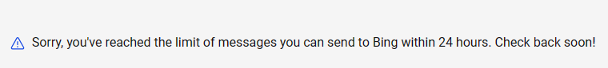

# ReEdgeGPT

_對 Bing 聊天功能的逆向工程_

[](https://reedgegpt.readthedocs.io/en/latest/?badge=latest)

[ReEdgeGPT Doc Click Here!](https://reedgegpt.readthedocs.io/en/latest/)

如果你有任何問題請先觀看問題與解答。

## 其他 README

<details open>

[英文](README.md) / [繁體中文](/Readmes/zh_tw.md)

</details>

<summary>

# 設定

</summary>

<details open>

## 安裝

```bash
python3 -m pip install re_edge_gpt --upgrade
```
## 環境需求

- python 3.9+
- 可以訪問此網址 <https://copilot.microsoft.com/> 的微軟帳號  (可選，主要看地區)
- 可以使用 Bing 聊天功能的地區 (中國需使用 VPN)

## 驗證

!!! 或許不再需要 !!!

**某些地區**, Bing 聊天功能 **對每個人** 可用, 所以你可以 **跳過這個步驟**. 你可以嘗試 **不登入與 Bing 聊天**.

這主要依賴於 **你的 IP 位址** 例如 使用一些已知的 IP  **屬於某些資料中心** (vServers, root servers, VPN, common proxies, ...), **你可能被要求登入** 如果是家用 IP 則不需要

如果你收到以下錯誤，你可以嘗試 **提供 cookie** 然後他就會開始運作。

`Exception: Authentication failed. You have not been accepted into the beta.`

### 收集 Cookie

- a) (簡單) 安裝最新版本的 Edge
- b) (進階) 或者使用任何瀏覽器但設置 user-agent (例如 `Mozilla/5.0 (Windows NT 10.0; Win64; x64) AppleWebKit/537.36 (KHTML, like Gecko) Chrome/111.0.0.0 Safari/537.36 Edg/111.0.1661.51`)你可以使用 "User-Agent Switcher and Manager" 來簡單的做到這一點 [Chrome](https://chrome.google.com/webstore/detail/user-agent-switcher-and-m/bhchdcejhohfmigjafbampogmaanbfkg) 或者 [Firefox](https://addons.mozilla.org/en-US/firefox/addon/user-agent-string-switcher/).

1. 讓一個瀏覽器看起來像是 Edge.
2. 開啟 [copilot](https://copilot.microsoft.com/)
3. 如果有聊天功能則可以繼續
4. 安裝 Cookie editor 擴充套件 [Chrome](https://chrome.google.com/webstore/detail/cookie-editor/hlkenndednhfkekhgcdicdfddnkalmdm) 或者 [Firefox](https://addons.mozilla.org/en-US/firefox/addon/cookie-editor/)
5. 開啟 [copilot](https://copilot.microsoft.com/)
6. 打開擴充套件
7. 點擊 "Export" 然後點擊 "Export as JSON" (這將會複製 Cookie 到你的剪貼版)
8. 貼上 Cookie 到檔案 `bing_cookies.json`.
   - 注意:  **Cookie 檔案 `bing_cookies.json` 必須遵守正確的 json 格式** 這樣才能正確讀取

### 在程式中使用 cookie:

```python
import json
from re_edge_gpt import Chatbot


async def create_bot():
    cookies = json.loads(open("./path/to/bing_cookies.json", encoding="utf-8").read())
    bot = await Chatbot.create(cookies=cookies)
    return bot

```

</details>

<summary>

# 如何使用聊天機器人

</summary>

<details open>

## 在命令列使用

```
 $ python3 -m re_edge_gpt -h

        ReEdgeGPT - A demo of reverse engineering the Bing GPT chatbot

        !help for help

        Type !exit to exit

usage: __main__.py [-h] [--enter-once] [--search-result] [--no-stream] [--rich] [--proxy PROXY] [--wss-link WSS_LINK]
                  [--style {creative,balanced,precise}] [--prompt PROMPT] [--cookie-file COOKIE_FILE]
                  [--history-file HISTORY_FILE] [--locale LOCALE]

options:
  -h, --help            show this help message and exit
  --enter-once
  --search-result
  --no-stream
  --rich
  --proxy PROXY         Proxy URL (e.g. socks5://127.0.0.1:1080)
  --wss-link WSS_LINK   WSS URL(e.g. wss://sydney.bing.com/sydney/ChatHub)
  --style {creative,balanced,precise}
  --prompt PROMPT       prompt to start with
  --cookie-file COOKIE_FILE
                        path to cookie file
  --history-file HISTORY_FILE
                        path to history file
  --locale LOCALE       your locale (e.g. en-US, zh-CN, en-IE, en-GB)
```

(China/US/UK/Norway has enhanced support for locale)

## 使用 Python

### 1. `Chatbot` 類別 和 `asyncio` 可以進行更精細的控制

用 Async 來提升體驗 例如:

```python
import asyncio
import json
from pathlib import Path

from re_edge_gpt import Chatbot
from re_edge_gpt import ConversationStyle


# If you are using jupyter pls install this package
# from nest_asyncio import apply


async def test_ask() -> None:
    bot = None
    try:
        cookies = json.loads(open(
            str(Path(str(Path.cwd()) + "/bing_cookies.json")), encoding="utf-8").read())
        bot = await Chatbot.create(cookies=cookies)
        response = await bot.ask(
            prompt="How to boil the egg",
            conversation_style=ConversationStyle.balanced,
            simplify_response=True
        )
        # If you are using non ascii char you need set ensure_ascii=False
        print(json.dumps(response, indent=2, ensure_ascii=False))
        # Raw response
        # print(response)
        assert response
    except Exception as error:
        raise error
    finally:
        if bot is not None:
            await bot.close()


if __name__ == "__main__":
    # If you are using jupyter pls use nest_asyncio apply()
    # apply()
    try:
        loop = asyncio.get_running_loop()
    except RuntimeError:
        loop = asyncio.get_event_loop()
    loop.run_until_complete(test_ask())


```

</details>

<summary>

# 如何產生圖片

</summary>

<details open>

## 取得驗證
> ### Chromium 基礎的瀏覽器 (Edge, Opera, Vivaldi, Brave)
> * 開啟 https://copilot.microsoft.com/
> * 按 F12 打開 console
> * 在 JavaScript console, 輸入 **cookieStore.get("_U").then(result => console.log(result.value))** 然後按 enter
> * 複製輸出這將會用在 --U or auth_cookie.

> ### Firefox
> * 開啟 https://copilot.microsoft.com/.
> * 按　F12 開啟開發者工具
> * 找到 storage 標籤
> * 打開 cookies 標籤
> * 點擊 https://copilot.microsoft.com/ cookie
> * 複製 _U　的值

```python
import os
import shutil
from pathlib import Path

from re_edge_gpt import ImageGen, ImageGenAsync

# create a temporary output directory for testing purposes
test_output_dir = "test_output"
# download a test image
test_image_url = "https://picsum.photos/200"
auth_cooker = open("bing_cookies.txt", "r+").read()
sync_gen = ImageGen(auth_cookie=auth_cooker)
async_gen = ImageGenAsync(auth_cookie=auth_cooker)


def test_save_images_sync():
    sync_gen.save_images([test_image_url], test_output_dir)
    sync_gen.save_images([test_image_url], test_output_dir, file_name="test_image")
    # check if the image was downloaded and saved correctly
    assert os.path.exists(os.path.join(test_output_dir, "test_image_0.jpeg"))
    assert os.path.exists(os.path.join(test_output_dir, "0.jpeg"))


# Generate image list sync
def test_generate_image_sync():
    image_list = sync_gen.get_images("tree")
    print(image_list)

if __name__ == "__main__":
    # Make dir to save image
    Path("test_output").mkdir(exist_ok=True)
    # Save image
    test_save_images_sync()
    # Generate image sync
    test_generate_image_sync()
    # Remove dir
    shutil.rmtree(test_output_dir)
```

</details>

# 問題與舉達

<details open>

> * Q: Exception: Throttled: Request is throttled.
>   * A: 已達到　Bing　的聊天限制.
>   * 
> * Q: RuntimeError: This event loop is already running
>   * A: 如果你正在使用 Jupyter 請使用 nest_asyncio.apply()
>   * Like: https://github.com/Integration-Automation/ReEdgeGPT/issues/30
> * Q: json.dumps 回傳非 utf-8 字元
>   * A: json.dumps(response, ensure_ascii=False)
>   * Like: https://github.com/Integration-Automation/ReEdgeGPT/issues/32
> * Q: Exception: UnauthorizedRequest: Cannot retrieve user status.
>   * A: 重新取得你的 cookie 檔案.
> * Q: Exception: conversationSignature
>   * A:清除你的 cookie 然後取得新的 cookie 檔案.
>   * Like: https://github.com/Integration-Automation/ReEdgeGPT/issues/17
>   * And: https://github.com/Integration-Automation/ReEdgeGPT/issues/22
> * Q: ValueError: Invalid header value b'_U=***\n'
> * A: 重新取得圖片產生的驗證 cookie.
> * Q: 圖像產生卡住或重新導向錯誤
>   * A: 我們不再能一次產生大量圖片 (因為 bing 的限制)
>   * See https://github.com/Integration-Automation/ReEdgeGPT/issues/22
> * Q: UnauthorizedRequest: Token issued by https://sydney.bing.com/sydney is invalid
>   * A: Bing 阻止了你的連線, 嘗試使用代理或新 cookie.

</details>